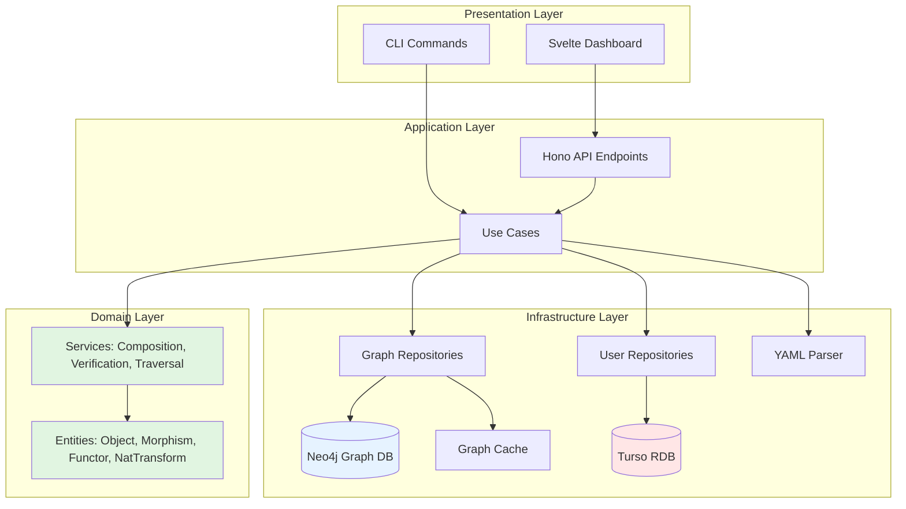

# Design Document

## Overview

Category Documentation Tool (CatDoc) MVPは、圏論の概念を活用してドキュメント間の関係性を管理するCLIツール＋Webダッシュボードです。本設計では、Svelte + Hono + Neo4j + Tursoのモダンな技術スタックを採用し、Clean Architectureの原則に基づいた保守性の高いシステムを構築します。

主要な設計目標：
- **圏論のドメインロジックを純粋なTypeScriptで実装**（外部依存なし）
- **HonoによるシンプルなAPI層**（CLIとWebダッシュボード両方をサポート）
- **Neo4jによる圏データの効率的な管理**（オブジェクト、射、関手、自然変換をグラフDBで保存）
- **Tursoによるユーザー/設定データの永続化**（RDBとしてメタデータ、認証情報を管理）
- **Svelteによる軽量で高速なUI**（グラフ可視化に最適化）

**データベース構成（ハイブリッド）：**
- **Neo4j（グラフDB）**: Objects、Morphisms、Functors、Natural Transformationsを保存。グラフトラバーサルとCypherクエリで高速検証
- **Turso（RDB）**: ユーザー情報、プロジェクト設定、セッション管理、監査ログを保存

## Steering Document Alignment

### Technical Standards (tech.md)

tech.mdはGo + Reactを想定していましたが、以下の理由でSvelte + Hono + Neo4j + Tursoに変更します：

**変更の妥当性：**
- **Hono (TypeScript)**: Go同様に高速で、型安全性を提供。Bunランタイムで実行すればGoに匹敵するパフォーマンス
- **Svelte**: React Flowより軽量で、バンドルサイズが小さく、ビルドが高速
- **Neo4j (グラフDB)**: 圏論のデータ（オブジェクト、射、関手）は本質的にグラフ構造。グラフDBを使うことで：
  - **高速なトラバーサル**: 射の合成、変換パス探索がO(1)〜O(log n)で可能
  - **Cypherクエリ**: 圏の公理検証がシンプルに記述可能（例: `MATCH (a)-[f]->(b)-[g]->(c) WHERE NOT EXISTS((a)-[:COMPOSED]->(c))`）
  - **インデックス最適化**: ノードとリレーションシップに自動インデックス
  - **スケーラビリティ**: 1000+ノードでもパフォーマンス維持
- **Turso (RDB)**: ユーザー情報、設定、監査ログなど、グラフ構造でないデータはRDBで管理

**維持する原則：**
- **3層アーキテクチャ**: Domain（圏論ロジック） → Application（CLI/API） → Infrastructure（DB/File）
- **Repository pattern**: データアクセスの抽象化
- **TDD workflow**: Gate-A/B/C による品質保証
- **パフォーマンス目標**: 起動1秒、検証1秒、レンダリング5秒（100ノード）

### Project Structure (structure.md)

structure.mdのGo構造を、TypeScript + Svelteの慣習に適応させます：

```
category-doc-tool/
├── src/
│   ├── domain/                  # 圏論コアロジック（純粋なTypeScript）
│   │   ├── entities/
│   │   │   ├── Object.ts        # オブジェクト定義
│   │   │   ├── Morphism.ts      # モーフィズム定義
│   │   │   ├── Category.ts      # カテゴリ定義
│   │   │   ├── Functor.ts       # 関手定義
│   │   │   └── NaturalTransformation.ts # 自然変換定義
│   │   ├── services/
│   │   │   ├── CompositionService.ts  # 合成ロジック
│   │   │   ├── VerificationService.ts # 公理検証
│   │   │   └── TraversalService.ts    # グラフ探索
│   │   └── interfaces/
│   │       └── IRepository.ts   # Repository interface
│   ├── application/             # ユースケース層
│   │   ├── cli/                 # CLIコマンド
│   │   │   ├── init.ts
│   │   │   ├── import.ts
│   │   │   ├── validate.ts
│   │   │   ├── search.ts
│   │   │   ├── trace.ts
│   │   │   └── dashboard.ts
│   │   └── api/                 # APIエンドポイント（Hono）
│   │       ├── objects.ts       # /api/objects
│   │       ├── morphisms.ts     # /api/morphisms
│   │       ├── functors.ts      # /api/functors
│   │       ├── graph.ts         # /api/graph
│   │       └── validate.ts      # /api/validate
│   ├── infrastructure/          # 外部依存層
│   │   ├── database/
│   │   │   ├── neo4j/
│   │   │   │   ├── connection.ts      # Neo4j接続設定
│   │   │   │   ├── schema.ts          # ノード/リレーションシップ定義
│   │   │   │   ├── cypher-queries.ts  # 再利用可能なCypherクエリ
│   │   │   │   └── repositories/
│   │   │   │       ├── ObjectRepository.ts
│   │   │   │       ├── MorphismRepository.ts
│   │   │   │       ├── CategoryRepository.ts
│   │   │   │       ├── FunctorRepository.ts
│   │   │   │       └── NaturalTransformationRepository.ts
│   │   │   └── turso/
│   │   │       ├── connection.ts      # Turso接続設定
│   │   │       ├── schema.ts          # テーブル定義（users, settings）
│   │   │       └── repositories/
│   │   │           ├── UserRepository.ts
│   │   │           └── ConfigRepository.ts
│   │   ├── parsers/
│   │   │   ├── YamlParser.ts    # category.yaml解析
│   │   │   └── MarkdownParser.ts # Markdown解析
│   │   └── cache/
│   │       └── GraphCache.ts    # インメモリグラフキャッシュ（オプション）
│   ├── presentation/            # UI層（Svelte）
│   │   ├── lib/
│   │   │   ├── components/
│   │   │   │   ├── GraphView.svelte       # グラフ可視化
│   │   │   │   ├── ObjectList.svelte      # オブジェクト一覧
│   │   │   │   ├── MorphismList.svelte    # モーフィズム一覧
│   │   │   │   ├── FunctorView.svelte     # 関手可視化
│   │   │   │   ├── CategorySelector.svelte # カテゴリ選択
│   │   │   │   └── DetailPanel.svelte     # 詳細パネル
│   │   │   ├── stores/
│   │   │   │   ├── categoryStore.ts # カテゴリデータストア
│   │   │   │   └── uiStore.ts       # UI状態管理
│   │   │   └── utils/
│   │   │       ├── graphLayout.ts   # レイアウトアルゴリズム
│   │   │       └── apiClient.ts     # API通信
│   │   ├── routes/
│   │   │   └── +page.svelte         # メインページ
│   │   └── app.html
│   ├── index.ts                 # CLIエントリーポイント
│   └── server.ts                # Honoサーバー
├── tests/
│   ├── domain/                  # ドメインロジックのテスト
│   │   ├── Object.test.ts
│   │   ├── Composition.test.ts
│   │   ├── Verification.test.ts
│   │   ├── Functor.test.ts
│   │   └── NaturalTransformation.test.ts
│   ├── integration/             # 統合テスト
│   │   ├── cli.test.ts
│   │   └── api.test.ts
│   └── fixtures/                # テストデータ
│       ├── simple-category.yaml
│       └── multi-domain.yaml
├── package.json
├── tsconfig.json
├── vite.config.ts               # Svelteビルド設定
└── bun.lockb
```

**命名規則：**
- TypeScript: PascalCase（クラス/インターフェース）、camelCase（関数/変数）
- Svelte: PascalCase.svelte（コンポーネント）
- テスト: [filename].test.ts

## Code Reuse Analysis

新規プロジェクトのため、既存コードの再利用はありませんが、以下のライブラリを活用します：

### Existing Components to Leverage

**TypeScript Ecosystem:**
- **Hono**: 軽量で高速なWebフレームワーク（Express/Fastifyの代替）
- **neo4j-driver**: Neo4j公式TypeScriptドライバー（Cypherクエリ実行）
- **@libsql/client**: Turso公式クライアント
- **zod**: スキーマバリデーション（YAML/JSONの検証）
- **yaml**: category.yamlの解析
- **commander**: CLIコマンドパーサー

**Svelte Ecosystem:**
- **svelte-graph** または **cytoscape.js**: グラフ可視化（React Flowの代替）
- **@sveltejs/kit**: Svelteアプリケーションフレームワーク
- **svelte/store**: 状態管理

### Integration Points

- **Neo4j Database**: グラフデータの保存と検索。Cypherクエリで圏論的検証を実行
- **Turso Database**: ユーザー情報、プロジェクト設定、監査ログの保存
- **File System**: `.catdoc/category.yaml`、Markdownファイルの読み込み
- **標準出力**: CLIのフィードバック表示

## Architecture

### 全体アーキテクチャ図



### Modular Design Principles

- **Single File Responsibility**: 各ファイルは1つのエンティティ/サービス/コンポーネントを定義
- **Component Isolation**: Svelteコンポーネントは独立して動作可能（propsのみで通信）
- **Service Layer Separation**: ドメインサービスはRepositoryインターフェースに依存（実装には依存しない）
- **Utility Modularity**: グラフレイアウト、バリデーション、パーサーは独立したユーティリティとして実装

### 依存の方向

```
Presentation → Application → Domain
                           ↑
                Infrastructure
```

- **Domain層**: 外部依存ゼロ（純粋なTypeScript）
- **Application層**: Domain層のインターフェースに依存
- **Infrastructure層**: Domain層のインターフェースを実装
- **Presentation層**: Application層を通じてDomain層を利用

## Components and Interfaces

### Domain Layer

#### Object Entity
- **Purpose:** 圏論のオブジェクト（ドキュメント）を表現
- **Interfaces:**
  ```typescript
  class Object {
    constructor(id: string, title: string, domain: string, metadata: Record<string, any>, content?: string)
    getId(): string
    getTitle(): string
    getDomain(): string
    getMetadata(): Record<string, any>
    getContent(): string | undefined
  }
  ```
- **Dependencies:** なし
- **Reuses:** なし

#### Morphism Entity
- **Purpose:** 圏論の射（ドキュメント間の関係）を表現
- **Interfaces:**
  ```typescript
  class Morphism {
    constructor(id: string, name: string, source: string, target: string, metadata?: Record<string, any>)
    getId(): string
    getName(): string
    getSource(): string
    getTarget(): string
    compose(other: Morphism): Morphism | null  // 合成可能性チェック
  }
  ```
- **Dependencies:** Object（source/targetの参照）
- **Reuses:** なし

#### Category Entity
- **Purpose:** カテゴリ（ドメイン層）を表現
- **Interfaces:**
  ```typescript
  class Category {
    constructor(id: string, name: string, objects: Object[], morphisms: Morphism[])
    getId(): string
    getName(): string
    getObjects(): Object[]
    getMorphisms(): Morphism[]
    getObject(id: string): Object | undefined
    getMorphism(id: string): Morphism | undefined
  }
  ```
- **Dependencies:** Object, Morphism
- **Reuses:** なし

#### Functor Entity
- **Purpose:** 異なるカテゴリ間の関手を表現
- **Interfaces:**
  ```typescript
  class Functor {
    constructor(
      id: string,
      name: string,
      sourceCategory: string,
      targetCategory: string,
      objectMapping: Map<string, string>,
      morphismMapping: Map<string, string>
    )
    mapObject(objectId: string): string | undefined
    mapMorphism(morphismId: string): string | undefined
    preservesIdentity(): boolean  // 恒等射の保存チェック
    preservesComposition(): boolean  // 合成の保存チェック
  }
  ```
- **Dependencies:** Category
- **Reuses:** なし

#### NaturalTransformation Entity
- **Purpose:** 関手間の自然変換を表現
- **Interfaces:**
  ```typescript
  class NaturalTransformation {
    constructor(
      id: string,
      name: string,
      sourceFunctor: string,
      targetFunctor: string,
      components: Map<string, string>  // object id -> morphism id
    )
    getComponent(objectId: string): string | undefined
    satisfiesNaturality(): boolean  // 自然性条件チェック
  }
  ```
- **Dependencies:** Functor, Morphism
- **Reuses:** なし

#### VerificationService
- **Purpose:** 圏論の公理検証（恒等射、結合律、関手公理、自然性）
- **Interfaces:**
  ```typescript
  class VerificationService {
    verifyCategory(category: Category): VerificationResult
    verifyFunctor(functor: Functor, source: Category, target: Category): VerificationResult
    verifyNaturalTransformation(natTrans: NaturalTransformation, ...): VerificationResult
  }

  interface VerificationResult {
    isValid: boolean
    errors: string[]
    warnings: string[]
  }
  ```
- **Dependencies:** Category, Functor, NaturalTransformation
- **Reuses:** CompositionService

#### CompositionService
- **Purpose:** 射の合成、関手の合成を計算
- **Interfaces:**
  ```typescript
  class CompositionService {
    composeMorphisms(f: Morphism, g: Morphism): Morphism | null
    composeFunctors(f: Functor, g: Functor): Functor | null
  }
  ```
- **Dependencies:** Morphism, Functor
- **Reuses:** なし

#### TraversalService
- **Purpose:** グラフ探索、変換パスの探索
- **Interfaces:**
  ```typescript
  class TraversalService {
    findPath(source: string, target: string, category: Category): Morphism[]
    findDomainPath(sourceObj: string, targetCat: string, ...): TransformationPath[]
  }

  interface TransformationPath {
    steps: Array<Functor | NaturalTransformation>
    resultObject: string
  }
  ```
- **Dependencies:** Category, Functor, NaturalTransformation
- **Reuses:** なし

### Application Layer

#### CLI Commands
- **Purpose:** CLIインターフェースを提供
- **Interfaces:** `catdoc init`, `catdoc import`, `catdoc validate`, `catdoc search`, `catdoc trace`, `catdoc dashboard`
- **Dependencies:** VerificationService, TraversalService, Repositories
- **Reuses:** commander（CLIパーサー）

#### API Endpoints (Hono)
- **Purpose:** Web ダッシュボード用のRESTful API
- **Interfaces:**
  ```typescript
  GET /api/categories          // 全カテゴリ取得
  GET /api/categories/:id      // カテゴリ詳細
  GET /api/objects             // 全オブジェクト取得
  GET /api/morphisms           // 全モーフィズム取得
  GET /api/functors            // 全関手取得
  GET /api/graph               // グラフデータ取得
  POST /api/validate           // 検証実行
  POST /api/trace              // 変換パス探索
  ```
- **Dependencies:** 全Domainサービス、Repositories
- **Reuses:** Hono

### Infrastructure Layer

#### Neo4j Database
- **Purpose:** 圏論データ（グラフ構造）の永続化とクエリ
- **Interfaces:**
  ```typescript
  class Neo4jConnection {
    connect(uri: string, username: string, password: string): Promise<void>
    executeQuery(cypher: string, params: Record<string, any>): Promise<QueryResult>
    close(): Promise<void>
  }
  ```
- **Dependencies:** neo4j-driver
- **Reuses:** Neo4j公式ドライバー

#### Turso Database
- **Purpose:** ユーザー情報、設定、監査ログの永続化
- **Interfaces:**
  ```typescript
  class TursoConnection {
    connect(url: string, authToken: string): Promise<void>
    execute(sql: string, params: any[]): Promise<Result>
    close(): Promise<void>
  }
  ```
- **Dependencies:** @libsql/client
- **Reuses:** Turso公式SDK

#### Graph Repositories (Neo4j)
- **Purpose:** 圏データのCRUD操作（Repository pattern）
- **Interfaces:**
  ```typescript
  interface IObjectRepository {
    findAll(): Promise<Object[]>
    findById(id: string): Promise<Object | null>
    findByCategoryId(categoryId: string): Promise<Object[]>
    save(obj: Object): Promise<void>
    delete(id: string): Promise<void>
  }

  interface IMorphismRepository {
    findAll(): Promise<Morphism[]>
    findById(id: string): Promise<Morphism | null>
    findBySourceAndTarget(source: string, target: string): Promise<Morphism[]>
    findComposablePath(source: string, target: string): Promise<Morphism[]>
    save(morphism: Morphism): Promise<void>
    delete(id: string): Promise<void>
  }

  // Category, Functor, NaturalTransformationRepositoryも同様に定義
  ```
- **Dependencies:** Neo4jConnection, Domain Entities
- **Reuses:** Cypherクエリ

#### User Repositories (Turso)
- **Purpose:** ユーザー情報、設定のCRUD操作
- **Interfaces:**
  ```typescript
  interface IUserRepository {
    findById(id: string): Promise<User | null>
    save(user: User): Promise<void>
  }

  interface IConfigRepository {
    get(key: string): Promise<string | null>
    set(key: string, value: string): Promise<void>
  }
  ```
- **Dependencies:** TursoConnection
- **Reuses:** なし

#### YamlParser
- **Purpose:** category.yamlの解析とバリデーション
- **Interfaces:**
  ```typescript
  class YamlParser {
    parse(filePath: string): Promise<CategoryConfig>
    validate(config: CategoryConfig): ValidationResult
  }

  interface CategoryConfig {
    categories: CategoryDef[]
    morphisms: MorphismDef[]
    functors: FunctorDef[]
    naturalTransformations: NatTransDef[]
  }
  ```
- **Dependencies:** yaml, zod
- **Reuses:** yaml（YAML解析）、zod（バリデーション）

### Presentation Layer (Svelte)

#### GraphView.svelte
- **Purpose:** グラフの可視化とインタラクション
- **Interfaces:** Props: `{ categories: Category[], selectedCategory?: string }`
- **Dependencies:** cytoscape.js または svelte-graph
- **Reuses:** グラフライブラリ

#### ObjectList.svelte
- **Purpose:** オブジェクト一覧表示
- **Interfaces:** Props: `{ objects: Object[], onSelect: (id: string) => void }`
- **Dependencies:** categoryStore
- **Reuses:** なし

#### FunctorView.svelte
- **Purpose:** 関手のマッピングを可視化
- **Interfaces:** Props: `{ functor: Functor, sourceCategory: Category, targetCategory: Category }`
- **Dependencies:** GraphViewコンポーネント
- **Reuses:** GraphView.svelte

## Data Models

### Neo4j Graph Schema

圏論データはすべてNeo4jのノードとリレーションシップで表現します。

#### ノード定義

**Object ノード:**
```cypher
CREATE (obj:Object {
  id: 'obj-001',
  title: 'Business Requirement',
  domain: 'business-domain',
  categoryId: 'cat-001',
  metadata: '{"author": "user1", "version": "1.0"}',
  content: 'Markdown content here...',
  createdAt: timestamp()
})

-- インデックス
CREATE INDEX obj_id_idx FOR (n:Object) ON (n.id);
CREATE INDEX obj_category_idx FOR (n:Object) ON (n.categoryId);
CREATE INDEX obj_domain_idx FOR (n:Object) ON (n.domain);
```

**Category ノード:**
```cypher
CREATE (cat:Category {
  id: 'cat-001',
  name: 'business-domain',
  description: '業務ドメインのカテゴリ',
  createdAt: timestamp()
})

-- インデックス
CREATE INDEX cat_id_idx FOR (n:Category) ON (n.id);
CREATE INDEX cat_name_idx FOR (n:Category) ON (n.name);
```

#### リレーションシップ定義

**MORPHISM リレーションシップ（射）:**
```cypher
MATCH (source:Object {id: 'obj-001'}), (target:Object {id: 'obj-002'})
CREATE (source)-[:MORPHISM {
  id: 'morph-001',
  name: 'depends-on',
  metadata: '{"type": "dependency"}',
  createdAt: timestamp()
}]->(target)

-- インデックス
CREATE INDEX morph_id_idx FOR ()-[r:MORPHISM]-() ON (r.id);
```

**BELONGS_TO リレーションシップ（オブジェクト→カテゴリ）:**
```cypher
MATCH (obj:Object {id: 'obj-001'}), (cat:Category {id: 'cat-001'})
CREATE (obj)-[:BELONGS_TO]->(cat)
```

**IDENTITY リレーションシップ（恒等射）:**
```cypher
MATCH (obj:Object {id: 'obj-001'})
CREATE (obj)-[:IDENTITY {
  id: 'id-obj-001',
  name: 'id_obj-001',
  createdAt: timestamp()
}]->(obj)
```

**COMPOSED リレーションシップ（合成射）:**
```cypher
// f: A→B と g: B→C から g∘f: A→C を作成
MATCH (a:Object)-[f:MORPHISM]->(b:Object)-[g:MORPHISM]->(c:Object)
WHERE NOT EXISTS((a)-[:COMPOSED]->(c))
CREATE (a)-[:COMPOSED {
  id: 'composed-' + f.id + '-' + g.id,
  name: g.name + '∘' + f.name,
  components: [f.id, g.id],
  createdAt: timestamp()
}]->(c)
```

**Functor ノード:**
```cypher
CREATE (func:Functor {
  id: 'func-001',
  name: 'BusinessToSpec',
  sourceCategoryId: 'cat-business',
  targetCategoryId: 'cat-spec',
  objectMapping: '{"obj-001": "spec-obj-001", "obj-002": "spec-obj-002"}',
  morphismMapping: '{"morph-001": "spec-morph-001"}',
  createdAt: timestamp()
})

-- インデックス
CREATE INDEX func_id_idx FOR (n:Functor) ON (n.id);
```

**MAPS_OBJECT リレーションシップ（関手のオブジェクトマッピング）:**
```cypher
MATCH (func:Functor {id: 'func-001'}),
      (src:Object {id: 'obj-001'}),
      (tgt:Object {id: 'spec-obj-001'})
CREATE (func)-[:MAPS_OBJECT {from: src.id}]->(tgt)
```

**NaturalTransformation ノード:**
```cypher
CREATE (nat:NaturalTransformation {
  id: 'nat-001',
  name: 'Refinement',
  sourceFunctorId: 'func-001',
  targetFunctorId: 'func-002',
  components: '{"obj-001": "morph-refine-001"}',
  createdAt: timestamp()
})

-- インデックス
CREATE INDEX nat_id_idx FOR (n:NaturalTransformation) ON (n.id);
```

### Database Schema (Turso RDB)

Tursoは圏論データ以外のメタデータのみを保存します。

#### users テーブル
```sql
CREATE TABLE users (
  id TEXT PRIMARY KEY,
  name TEXT NOT NULL,
  email TEXT UNIQUE NOT NULL,
  created_at INTEGER DEFAULT (strftime('%s', 'now'))
);
```

#### settings テーブル
```sql
CREATE TABLE settings (
  key TEXT PRIMARY KEY,
  value TEXT NOT NULL,
  updated_at INTEGER DEFAULT (strftime('%s', 'now'))
);
-- プロジェクト設定、Neo4j接続情報など
```

#### audit_logs テーブル
```sql
CREATE TABLE audit_logs (
  id INTEGER PRIMARY KEY AUTOINCREMENT,
  user_id TEXT,
  action TEXT NOT NULL,  -- 'create', 'update', 'delete', 'validate'
  resource_type TEXT NOT NULL,  -- 'object', 'morphism', 'functor'
  resource_id TEXT NOT NULL,
  details TEXT,  -- JSON形式
  created_at INTEGER DEFAULT (strftime('%s', 'now')),
  FOREIGN KEY (user_id) REFERENCES users(id)
);
CREATE INDEX idx_audit_logs_user ON audit_logs(user_id);
CREATE INDEX idx_audit_logs_resource ON audit_logs(resource_type, resource_id);
```

### category.yaml スキーマ例

```yaml
categories:
  - id: business-domain
    name: Business Domain
    description: 業務ドメインのドキュメント
  - id: spec-domain
    name: Specification Domain
    description: 仕様ドメインのドキュメント

morphisms:
  - id: morph-001
    name: depends-on
    source: obj-001
    target: obj-002
    category: business-domain

functors:
  - id: functor-business-to-spec
    name: BusinessToSpec
    source_category: business-domain
    target_category: spec-domain
    object_mapping:
      obj-001: spec-obj-001
      obj-002: spec-obj-002
    morphism_mapping:
      morph-001: spec-morph-001

natural_transformations:
  - id: nat-trans-001
    name: Refinement
    source_functor: functor-business-to-spec
    target_functor: functor-business-to-spec-v2
    components:
      obj-001: morph-refine-001
```

## Error Handling

### Error Scenarios

1. **Scenario: Neo4jデータベース接続失敗**
   - **Handling:**
     - 3回リトライ（指数バックオフ）
     - 失敗時はエラーメッセージを表示し、処理を中断（Neo4jなしでは圏データにアクセスできない）
     - エラーログを `.catdoc/error.log` に記録
   - **User Impact:** CLI: "❌ Neo4j connection failed. Please check your connection settings in .catdoc/config.yaml" / Dashboard: 接続エラーページ表示

2. **Scenario: Tursoデータベース接続失敗**
   - **Handling:**
     - 3回リトライ（指数バックオフ）
     - 失敗時は警告を表示し、認証なしモードで続行（ユーザー情報にアクセスできないが、圏データは利用可能）
     - エラーログを `.catdoc/error.log` に記録
   - **User Impact:** CLI: "⚠️  Turso connection failed. Running without user authentication." / Dashboard: 認証なしバナー表示

3. **Scenario: category.yaml解析エラー**
   - **Handling:**
     - zodバリデーションでスキーマチェック
     - 詳細なエラーメッセージ（行番号、フィールド名）を表示
     - 部分的に有効なデータは読み込み（warnings表示）
   - **User Impact:** "❌ Invalid YAML at line 15: 'source_category' is required"

4. **Scenario: 圏の公理違反（恒等射なし、結合律違反）**
   - **Handling:**
     - VerificationServiceまたはCypherクエリで検出
     - 違反箇所を具体的にレポート（オブジェクトID、射名）
     - 自動修正の提案（可能な場合）
   - **User Impact:** "⚠️  Category 'business-domain': Missing identity morphism for object 'obj-001'. Run `catdoc fix` to auto-generate."

5. **Scenario: 関手の公理違反**
   - **Handling:**
     - 恒等射の保存、合成の保存をCypherクエリでチェック
     - 違反するマッピングを具体的に表示
   - **User Impact:** "❌ Functor 'BusinessToSpec': Does not preserve composition: f∘g ≠ F(f)∘F(g) for morphisms 'morph-001', 'morph-002'"

6. **Scenario: 自然変換の自然性条件違反**
   - **Handling:**
     - 可換図式をCypherクエリでチェック
     - どのオブジェクトで可換性が崩れるか表示
   - **User Impact:** "❌ Natural transformation 'Refinement': Naturality fails at object 'obj-001'"

7. **Scenario: Markdownファイルが見つからない**
   - **Handling:**
     - ファイルパス存在チェック
     - 類似パスを提案（Levenshtein距離）
   - **User Impact:** "❌ File not found: './docs/business.md'. Did you mean './doc/business.md'?"

8. **Scenario: グラフレンダリングタイムアウト（1000+ノード）**
   - **Handling:**
     - 進捗バー表示
     - 10秒以上かかる場合は中断確認
     - クラスタリング表示の提案
   - **User Impact:** "⏳ Rendering 1500 nodes... This may take a while. Press Ctrl+C to cancel."

## Testing Strategy

### Unit Testing

**対象:**
- Domain層のすべてのエンティティとサービス
- Infrastructure層のRepositories（モックDB使用）
- Parsers、Validators

**ツール:**
- **Vitest**: 高速なTypeScriptテストランナー
- **Bun:test**: Bunネイティブのテスト機能

**カバレッジ目標:** 80%以上

**重点テストケース:**
- `Morphism.compose()`: 合成可能性のすべての組み合わせ
- `VerificationService.verifyCategory()`: 恒等射、結合律のエッジケース
- `VerificationService.verifyFunctor()`: 関手の公理（恒等射保存、合成保存）
- `VerificationService.verifyNaturalTransformation()`: 自然性条件
- `TraversalService.findDomainPath()`: 複雑なドメイン階層でのパス探索

**Property-based Testing:**
- 任意の射の合成が結合律を満たすか（fast-check使用）
- 任意の関手が公理を満たすか

### Integration Testing

**対象:**
- CLI全コマンド（init, import, validate, search, trace, dashboard）
- API全エンドポイント（GET/POST）
- YAML解析 → DB保存 → 検証のフルフロー

**ツール:**
- **Vitest**: 統合テスト実行
- **supertest**: Hono APIテスト

**テストシナリオ:**
1. `catdoc init` → `.catdoc/` 作成 → Turso DB初期化
2. `catdoc import docs/*.md` → オブジェクト保存 → `catdoc list` で確認
3. `category.yaml` 作成 → `catdoc validate` → エラーレポート検証
4. `catdoc trace obj-001 spec-domain` → 変換パス探索
5. `catdoc dashboard` → Honoサーバー起動 → `/api/graph` レスポンス確認

### End-to-End Testing

**対象:**
- ユーザーの実際の操作フロー（CLI + Webダッシュボード）

**ツール:**
- **Playwright**: Svelteダッシュボードのブラウザテスト
- **CLI統合テスト**: シェルスクリプトでコマンド実行

**ユーザーシナリオ:**
1. **新規プロジェクト作成:**
   - `catdoc init`
   - `catdoc import docs/business/*.md`
   - `catdoc import docs/spec/*.md`
   - `category.yaml` 編集（関手とモーフィズム定義）
   - `catdoc validate`
   - エラー修正
   - `catdoc dashboard` 起動
   - ブラウザでグラフ確認

2. **ドメイン間トレース:**
   - `catdoc trace business-req-001 implementation-domain`
   - 複数パスの表示確認
   - ダッシュボードでパスをビジュアル確認

3. **関手の可視化:**
   - ダッシュボードで「関手表示」モード選択
   - 特定の関手を選択
   - マッピングがハイライト表示されることを確認

**成功基準:**
- すべてのシナリオが5分以内に完了
- エラーメッセージが明確で実行可能
- ダッシュボードが5秒以内にロード

## Performance Considerations

**最適化戦略:**
1. **Neo4jインデックス**: ノードの`id`、`categoryId`、`domain`にインデックスを作成し、クエリを高速化
2. **Cypherクエリ最適化**:
   - `MATCH`パターンを効率的に記述（早期フィルタリング）
   - `LIMIT`句で結果セットを制限
   - `EXPLAIN`/`PROFILE`でクエリプランを分析
3. **グラフトラバーサル**: Neo4jのネイティブトラバーサルアルゴリズムを活用（DFS/BFS）
4. **バッチ処理**: YAMLから大量データをインポートする際は、`UNWIND`を使ったバッチ挿入
5. **インメモリキャッシュ**: 頻繁にアクセスされるカテゴリ情報をアプリケーションレベルでキャッシュ
6. **遅延ロード**: ダッシュボードで可視範囲のノードのみレンダリング
7. **Web Workers**: グラフレイアウト計算をバックグラウンドスレッドで実行

**ベンチマーク目標（requirements.mdより）:**
- 起動時間: 1秒以内
- 検証速度: 1000ノード、5000エッジを1秒以内
- 関手検証: 10個の関手（各100マッピング）を500ms以内
- 自然変換検証: 5個の自然変換を1秒以内
- ドメイン間トレース: 5層のドメイン階層で500ms以内
- グラフレンダリング: 100ノードを5秒以内
