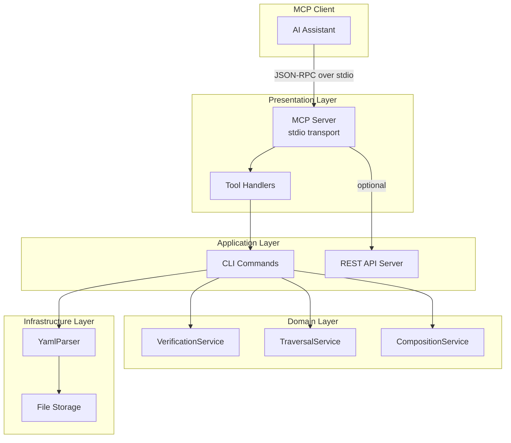

# Design Document: MCP Server for CatDoc

## Overview

CatDocの既存CLI機能をModel Context Protocol (MCP)サーバーとして公開する。MCPサーバーはstdioトランスポートを使用し、AIアシスタント（Claude Code、Cursor等）からドキュメント管理・検証機能にアクセスできるようにする。

## Steering Document Alignment

### Technical Standards (tech.md)

- **言語**: TypeScript（既存実装に準拠）
- **ランタイム**: Bun（既存実装に準拠）
- **フレームワーク**: @modelcontextprotocol/sdk（公式TypeScript SDK）
- **スキーマ検証**: Zod（MCP SDKのpeer dependency、既存依存に存在）

### Project Structure (structure.md)

MCPサーバー実装は以下のディレクトリ構造に配置：

```
src/
├── presentation/
│   └── mcp/
│       ├── server.ts          # MCPサーバーエントリーポイント
│       ├── tools/             # MCPツール定義
│       │   ├── index.ts       # ツール登録
│       │   ├── categories.ts  # カテゴリ管理ツール
│       │   ├── objects.ts     # オブジェクト管理ツール
│       │   ├── morphisms.ts   # 射管理ツール
│       │   ├── functors.ts    # 関手ツール
│       │   ├── validate.ts    # 検証ツール
│       │   ├── trace.ts       # パス探索ツール
│       │   ├── search.ts      # 検索ツール
│       │   └── graph.ts       # グラフデータツール
│       └── types.ts           # MCP固有の型定義
```

## Code Reuse Analysis

### Existing Components to Leverage

- **`src/application/cli/validate.ts`**: `validateAll`, `validateCategories`, `validateFunctors`, `validateNaturalTransformations`関数を再利用
- **`src/application/cli/list.ts`**: `listObjects`, `listMorphisms`, `listCategories`関数を再利用
- **`src/application/cli/show.ts`**: `showObject`, `showCategory`, `showFunctor`関数を再利用
- **`src/application/cli/trace.ts`**: `tracePath`, `traceDomainPath`関数を再利用
- **`src/application/cli/search.ts`**: `searchObjects`関数を再利用
- **`src/application/cli/init.ts`**: `initProject`関数を再利用
- **`src/application/cli/import.ts`**: `importDocuments`関数を再利用
- **`src/application/cli/dashboard.ts`**: `createDashboardServer`関数を再利用
- **`src/infrastructure/parsers/YamlParser.ts`**: カテゴリ定義の読み込み
- **`src/domain/services/VerificationService.ts`**: 圏論公理の検証ロジック

### Integration Points

- **既存CLI**: MCPサーバーは既存CLI関数をラップし、JSON形式で結果を返す
- **ダッシュボード**: `--dashboard`オプションで既存ダッシュボードサーバーを起動
- **ファイルストレージ**: `.catdoc/category.yaml`からデータを読み込み

## Architecture

MCPサーバーはPresentation層に配置し、既存のApplication層（CLI）をアダプターパターンで呼び出す。



### Modular Design Principles

- **Single File Responsibility**: 各ツールファイルは1つのドメイン（categories, objects等）を担当
- **Component Isolation**: MCPツールは独立してテスト可能
- **Service Layer Separation**: MCPツールはCLI関数を呼び出すだけで、ビジネスロジックは持たない
- **Utility Modularity**: 共通のエラーハンドリング、データ変換は`types.ts`に集約

## Components and Interfaces

### Component 1: MCP Server (`server.ts`)

- **Purpose**: MCPサーバーのエントリーポイント、ツール登録、トランスポート管理
- **Interfaces**:
  ```typescript
  export function createMcpServer(options?: McpServerOptions): McpServer;
  export function startMcpServer(server: McpServer): Promise<void>;
  ```
- **Dependencies**: `@modelcontextprotocol/sdk`, tool handlers
- **Reuses**: None (new component)

### Component 2: Tool Handlers (`tools/*.ts`)

- **Purpose**: 各MCPツールの実装
- **Interfaces**:
  ```typescript
  // Example: validate.ts
  export const validateTool: ToolDefinition = {
    name: "catdoc_validate",
    description: "Validate all category structures",
    inputSchema: z.object({ categoryId: z.string().optional() }),
    handler: async (params) => ValidateResult
  };
  ```
- **Dependencies**: CLI関数、YamlParser
- **Reuses**: 既存CLI関数をすべて再利用

### Component 3: CLI Entry Point Extension (`index.ts`)

- **Purpose**: `catdoc mcp`コマンドの追加
- **Interfaces**:
  ```typescript
  program.command("mcp")
    .option("--dashboard", "Start dashboard server")
    .option("--port <port>", "Dashboard port")
    .action(startMcpCommand);
  ```
- **Dependencies**: MCP Server
- **Reuses**: 既存commanderプログラム

## Data Models

### ToolDefinition

```typescript
type ToolDefinition = {
  name: string;                    // MCPツール名（catdoc_プレフィックス）
  description: string;             // ツールの説明
  inputSchema: ZodSchema;          // 入力パラメータスキーマ
  handler: (params: unknown) => Promise<ToolResult>;
};
```

### ToolResult

```typescript
type ToolResult = {
  content: Array<{
    type: "text";
    text: string;  // JSON文字列化された結果
  }>;
  isError?: boolean;
};
```

### McpServerOptions

```typescript
type McpServerOptions = {
  projectPath?: string;            // プロジェクトルート（デフォルト: cwd）
  dashboard?: boolean;             // ダッシュボード起動
  dashboardPort?: number;          // ダッシュボードポート
};
```

## Tool Definitions

| ツール名 | 説明 | 入力パラメータ |
|---------|------|---------------|
| `catdoc_init` | プロジェクト初期化 | `directory?: string`, `force?: boolean` |
| `catdoc_list_categories` | カテゴリ一覧 | `format?: "json"` |
| `catdoc_show_category` | カテゴリ詳細 | `categoryId: string` |
| `catdoc_list_objects` | オブジェクト一覧 | `domain?: string`, `limit?: number` |
| `catdoc_show_object` | オブジェクト詳細 | `objectId: string` |
| `catdoc_import_document` | ドキュメントインポート | `filePath: string`, `domain?: string` |
| `catdoc_list_morphisms` | 射一覧 | `categoryId?: string` |
| `catdoc_show_morphism` | 射詳細 | `morphismId: string` |
| `catdoc_validate` | 全体検証 | `categoryId?: string` |
| `catdoc_validate_category` | カテゴリ検証 | `categoryId: string` |
| `catdoc_validate_functor` | 関手検証 | `functorId: string` |
| `catdoc_validate_natural_transformation` | 自然変換検証 | `id: string` |
| `catdoc_trace` | パス探索 | `sourceId: string`, `targetId: string`, `findAll?: boolean` |
| `catdoc_search` | 検索 | `query: string`, `domain?: string`, `limit?: number` |
| `catdoc_list_functors` | 関手一覧 | なし |
| `catdoc_show_functor` | 関手詳細 | `functorId: string` |
| `catdoc_list_natural_transformations` | 自然変換一覧 | なし |
| `catdoc_show_natural_transformation` | 自然変換詳細 | `id: string` |
| `catdoc_get_graph` | グラフデータ取得 | `categoryId?: string` |

## Error Handling

### Error Scenarios

1. **プロジェクト未初期化**
   - **Handling**: `.catdoc/`ディレクトリが存在しない場合、明確なエラーメッセージを返す
   - **User Impact**: `"CatDoc project not initialized. Run catdoc_init first."`

2. **エンティティが見つからない**
   - **Handling**: 指定されたID/名前が存在しない場合、`isError: true`で結果を返す
   - **User Impact**: `"Category 'xxx' not found"`

3. **検証エラー**
   - **Handling**: 検証失敗は正常な結果として返す（`isValid: false`）
   - **User Impact**: エラー/警告リストを含むJSON

4. **ファイルアクセスエラー**
   - **Handling**: try-catchでキャッチし、エラーメッセージを返す
   - **User Impact**: `"Failed to read category.yaml: [error message]"`

5. **不正なパラメータ**
   - **Handling**: Zodスキーマで検証、MCPプロトコルがエラーを返す
   - **User Impact**: パラメータ検証エラーメッセージ

## Testing Strategy

### Unit Testing

- 各ツールハンドラーの単体テスト
- モック化したYamlParserを使用
- エラーケースのテスト（未初期化、エンティティなし等）

```typescript
// tests/presentation/mcp/tools/validate.test.ts
describe("catdoc_validate tool", () => {
  it("should return isValid: true for valid category", async () => {
    // ...
  });

  it("should return errors for invalid category", async () => {
    // ...
  });
});
```

### Integration Testing

- MCPサーバー起動→ツール呼び出し→結果検証
- stdioトランスポートのモック

```typescript
// tests/presentation/mcp/server.test.ts
describe("MCP Server", () => {
  it("should list all available tools", async () => {
    // ...
  });

  it("should execute catdoc_validate tool", async () => {
    // ...
  });
});
```

### End-to-End Testing

- 実際のMCPクライアント（テスト用）からの呼び出し
- ダッシュボード自動起動のテスト

## npm Package Configuration

### package.json Changes

```json
{
  "name": "@mayyya/catdoc-mcp",
  "version": "0.1.0",
  "bin": {
    "catdoc": "./dist/index.js",
    "catdoc-mcp": "./dist/mcp.js"
  },
  "exports": {
    ".": "./dist/index.js",
    "./mcp": "./dist/mcp.js"
  },
  "files": [
    "dist",
    "README.md"
  ],
  "dependencies": {
    "@modelcontextprotocol/sdk": "^1.24.0",
    "zod": "^3.25.0"
  }
}
```

### MCP設定例（claude_desktop_config.json）

```json
{
  "mcpServers": {
    "catdoc": {
      "command": "npx",
      "args": ["@mayyya/catdoc-mcp"],
      "env": {
        "CATDOC_PROJECT_PATH": "/path/to/project"
      }
    }
  }
}
```

## Implementation Notes

1. **stdio transport**: MCPサーバーはstdioトランスポートを使用。標準入出力でJSON-RPCメッセージを交換
2. **プロジェクトパス**: 環境変数`CATDOC_PROJECT_PATH`またはcwdをプロジェクトルートとして使用
3. **ダッシュボード連携**: `--dashboard`オプションでダッシュボードを起動し、URLをstderrに出力
4. **エラー出力**: MCPプロトコル外のログはstderrに出力（stdoutはMCPメッセージ専用）
